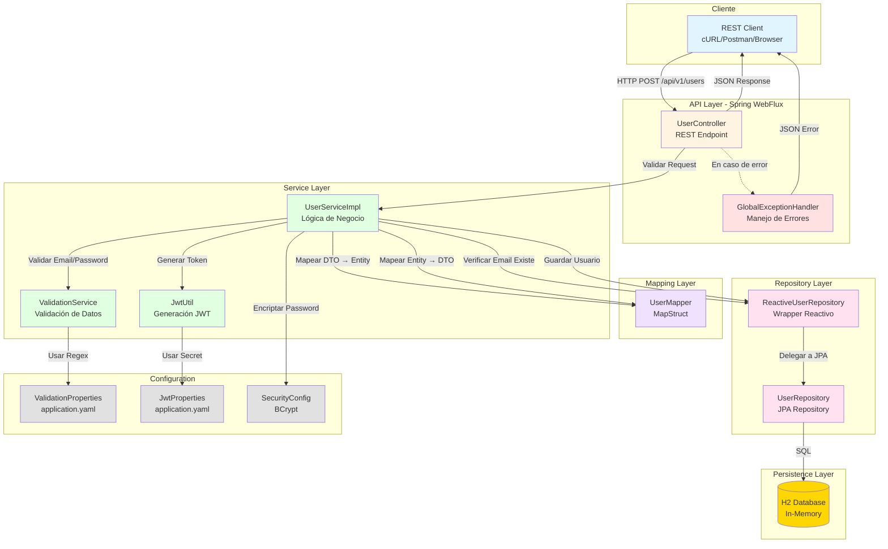
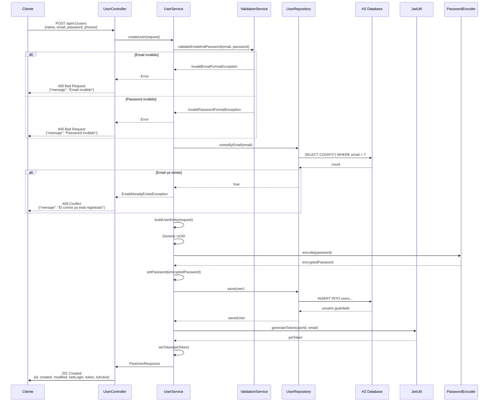
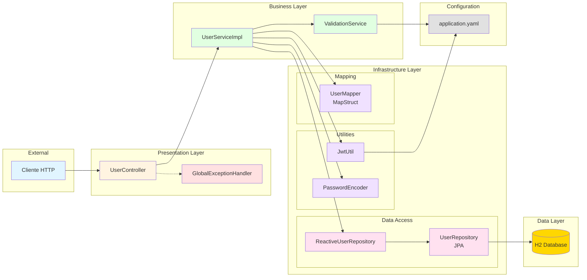
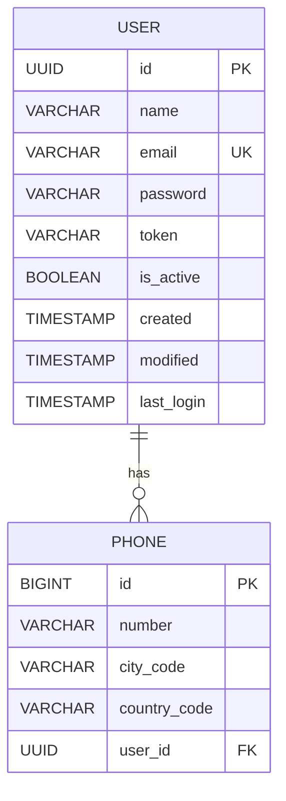
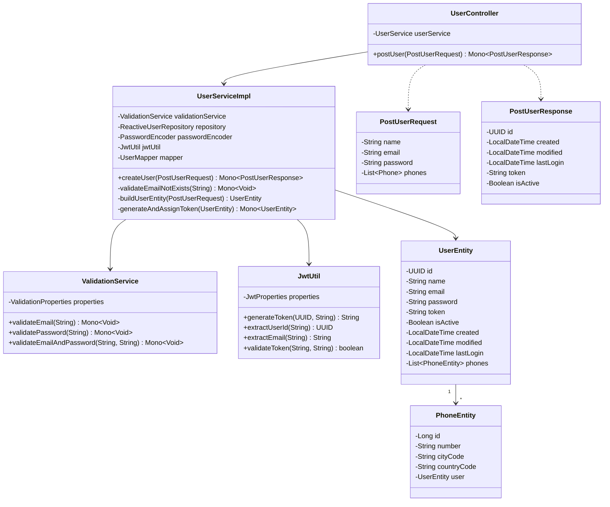
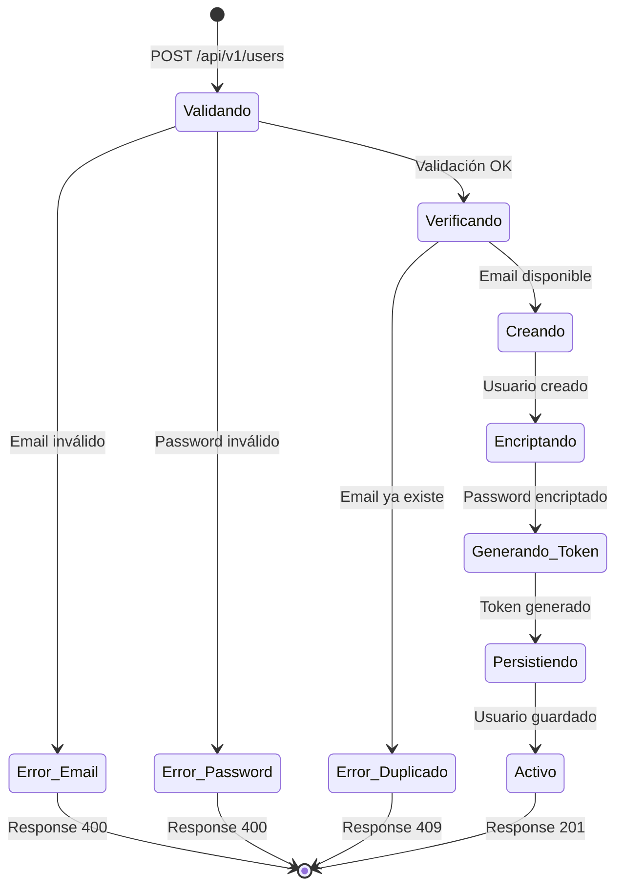
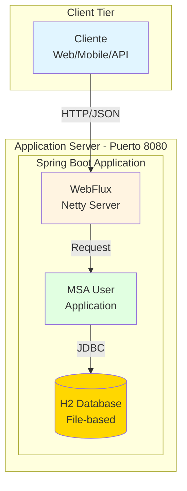
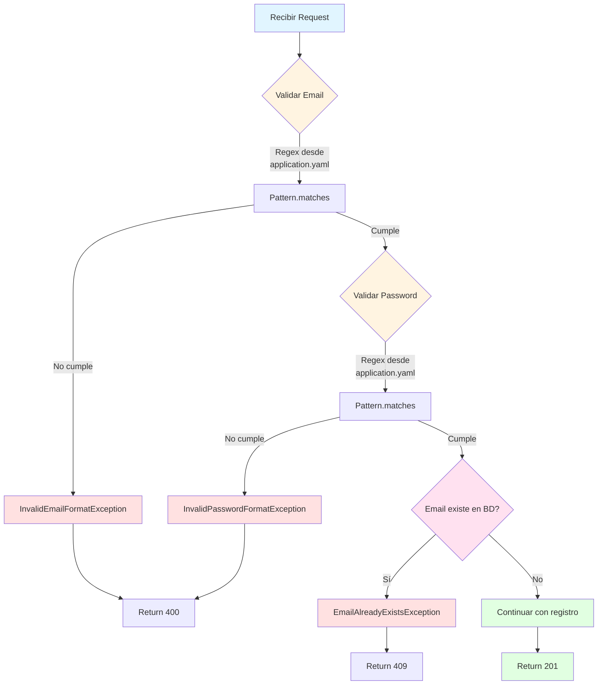

# Diagramas de la Solución - MSA User

## 1. Diagrama de Arquitectura General

## 2. Diagrama de Flujo - Registro de Usuario

## 3. Diagrama de Componentes

## 4. Modelo de Datos (Entidad-Relación)

## 5. Diagrama de Clases Principales

## 6. Diagrama de Estados del Usuario

## 7. Diagrama de Despliegue

## 8. Flujo de Validación Configurable

---

## Leyenda de Colores

- 🔵 **Azul claro**: Cliente/Entrada
- 🟡 **Amarillo**: Controllers/API
- 🟢 **Verde**: Servicios/Lógica
- 🟣 **Morado**: Utilidades/Mappers
- 🔴 **Rojo**: Errores/Excepciones
- 🟠 **Naranja**: Base de Datos
- ⚪ **Gris**: Configuración

## Herramientas Utilizadas

- **Mermaid**: Para todos los diagramas
- Renderizar en: GitHub, GitLab, VS Code (con extensión), o [Mermaid Live Editor](https://mermaid.live/)
