# Diagramas de la Solución - MSA User

## 1. Diagrama de Arquitectura General

## 2. Diagrama de Flujo - Registro de Usuario

```mermaid
sequenceDiagram
    participant C as Cliente
    participant UC as UserController
    participant US as UserService
    participant VS as ValidationService
    participant UR as UserRepository
    participant DB as H2 Database
    participant JU as JwtUtil
    participant PE as PasswordEncoder

    C->>UC: POST /api/v1/users<br/>{name, email, password, phones}
    
    UC->>US: createUser(request)
    
    US->>VS: validateEmailAndPassword(email, password)
    alt Email inválido
        VS-->>US: InvalidEmailFormatException
        US-->>UC: Error
        UC-->>C: 400 Bad Request<br/>{"mensaje": "Email inválido"}
    else Password inválido
        VS-->>US: InvalidPasswordFormatException
        US-->>UC: Error
        UC-->>C: 400 Bad Request<br/>{"mensaje": "Password inválido"}
    end
    
    US->>UR: existsByEmail(email)
    UR->>DB: SELECT COUNT(*) WHERE email = ?
    DB-->>UR: count
    
    alt Email ya existe
        UR-->>US: true
        US-->>UC: EmailAlreadyExistsException
        UC-->>C: 409 Conflict<br/>{"mensaje": "El correo ya está registrado"}
    end
    
    US->>US: buildUserEntity(request)
    US->>US: Generar UUID
    US->>PE: encode(password)
    PE-->>US: encryptedPassword
    US->>US: setPassword(encryptedPassword)
    
    US->>UR: save(user)
    UR->>DB: INSERT INTO users...
    DB-->>UR: usuario guardado
    UR-->>US: savedUser
    
    US->>JU: generateToken(userId, email)
    JU-->>US: jwtToken
    US->>US: setToken(jwtToken)
    
    US->>UC: PostUserResponse
    UC->>C: 201 Created<br/>{id, created, modified, lastLogin, token, isActive}
```

## 3. Diagrama de Componentes

## 4. Modelo de Datos (Entidad-Relación)

## 5. Diagrama de Clases Principales

## 6. Diagrama de Estados del Usuario

## 7. Diagrama de Despliegue

## 8. Flujo de Validación Configurable

```mermaid
flowchart TD
    A[Recibir Request] --> B{Validar Email}
    B -->|Regex desde<br/>application.yaml| C[Pattern.matches]
    C -->|No cumple| D[InvalidEmailFormatException]
    C -->|Cumple| E{Validar Password}
    
    E -->|Regex desde<br/>application.yaml| F[Pattern.matches]
    F -->|No cumple| G[InvalidPasswordFormatException]
    F -->|Cumple| H{Email existe en BD?}
    
    H -->|Sí| I[EmailAlreadyExistsException]
    H -->|No| J[Continuar con registro]
    
    D --> K[Return 400]
    G --> K
    I --> L[Return 409]
    J --> M[Return 201]
    
    style A fill:#e1f5ff
    style B fill:#fff4e1
    style E fill:#fff4e1
    style H fill:#ffe1f0
    style D fill:#ffe1e1
    style G fill:#ffe1e1
    style I fill:#ffe1e1
    style J fill:#e1ffe1
    style M fill:#e1ffe1
```

---

## Leyenda de Colores

- 🔵 **Azul claro**: Cliente/Entrada
- 🟡 **Amarillo**: Controllers/API
- 🟢 **Verde**: Servicios/Lógica
- 🟣 **Morado**: Utilidades/Mappers
- 🔴 **Rojo**: Errores/Excepciones
- 🟠 **Naranja**: Base de Datos
- ⚪ **Gris**: Configuración

## Herramientas Utilizadas

- **Mermaid**: Para todos los diagramas
- Renderizar en: GitHub, GitLab, VS Code (con extensión), o [Mermaid Live Editor](https://mermaid.live/)
